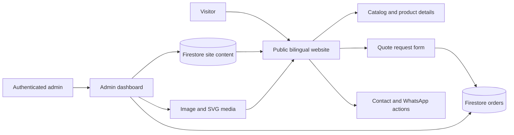

# AFAK CARPET

<p align="center">
  <strong>A premium digital showroom for carpets made for mosques, hotels, schools, and large spaces.</strong>
</p>

<p align="center">
  <a href="https://afak-carpet.pages.dev">Live Website</a>
  ·
  <a href="#getting-started">Run Locally</a>
  ·
  <a href="#administration">Administration</a>
</p>

<p align="center">
  
  
  
  
</p>

> **AFAK CARPET** is a refined, bilingual product experience for an Algerian carpet supplier. It combines a visual catalog, sector-focused browsing, quote requests, contact channels, and a practical Firebase-backed content management panel in one responsive website.

## The idea

A carpet supplier should not force visitors to navigate a generic online store. A mosque committee, hotel manager, school administrator, or project owner usually begins with a place, a use case, and a need for accurate guidance. AFAK CARPET is designed around that reality.

The public website leads visitors through four clear business areas: **mosques**, **hotels**, **kindergartens and schools**, and **conference halls or large spaces**. Each area can present its own products, images, descriptions, color options, specifications, and call-to-action. The result is closer to a carefully art-directed showroom than a basic product grid.

The experience is available in Arabic and English, supports right-to-left and left-to-right layouts, and is optimized for both desktop browsing and mobile interaction.

## Live experience

Visit the deployed website at **[afak-carpet.pages.dev](https://afak-carpet.pages.dev)**.

Visitors can explore the following journey:

| Experience | What it does |
|---|---|
| Hero presentation | Introduces the brand through an editable image slider, bilingual copy, and focused calls-to-action. |
| Sector discovery | Directs visitors to mosque, hotel, school, and large-space carpet collections. |
| Product catalog | Shows product imagery, specifications, colors, materials, references, and quote actions. |
| Product details | Opens a focused product view without losing the visitor’s place on the page. |
| Quote request | Collects the visitor’s name, phone number, field of interest, Algerian wilaya, commune, and project details. |
| Contact section | Presents phone, WhatsApp, email, address, and named social-platform links. |
| Mobile navigation | Provides a floating section menu with custom SVG icons and an emoji fallback. |
| Language switcher | Changes the interface between Arabic and English while preserving the RTL/LTR direction. |

## Why the interface feels different

AFAK CARPET uses a restrained visual language: deep navy, warm neutrals, strong typography, generous whitespace, and image-led product presentation. The design is intentionally calm and architectural, reflecting the environments the products are made for.

The website also includes small interaction details that make the catalog feel considered rather than assembled: responsive one- or two-column product layouts, a mobile drawer, hero swipe support, smooth section navigation, product hash links, a back-to-top control, color filtering, and quote actions that remain close to the product context.

## Administration

The protected admin panel gives the business team a practical way to maintain the showroom without editing HTML by hand. Content is stored in Firestore and synchronized through the existing Firebase client layer [1] [2].

The panel supports:

| Admin area | Capabilities |
|---|---|
| Site settings | Brand name, logo, contact details, social links, colors, visibility switches, and floating navigation. |
| Hero slides | Bilingual headings, supporting text, primary and secondary actions, destination links, and images. |
| Categories | Sector names, descriptions, images, ordering, and color-filter visibility. |
| Products | Names, translated content, specifications, prices, colors, materials, images, visibility, featuring, and ordering. |
| Projects | Completed-installation gallery items with captions and ordering. |
| Trust content | Statistics, testimonials, certifications, and independent visibility controls. |
| Media library | Reusable uploaded images and media selection. |
| Orders | Quote-request review with editable statuses: pending, processing, contacted, completed, and cancelled. |

Repeatable content is organized as compact, click-to-edit rows. This keeps the panel readable when the catalog grows and makes it easier to scan a large amount of content before opening a specific item.

## Technical foundation

AFAK CARPET is intentionally lightweight. It does not require a bundler, a server-rendered framework, or a SQL database for the current experience.

| Layer | Implementation |
|---|---|
| Public interface | Semantic HTML, responsive CSS, and browser-native ES modules. |
| Styling | `style.css`, with shared public and admin design tokens and responsive layouts. |
| Client logic | `index.html`, `admin.html`, and the shared `app.js` data layer. |
| Data | Cloud Firestore for site content and quote requests [1] [2]. |
| Authentication | Firebase Authentication for protected admin access [3]. |
| Image hosting | Admin-selectable ImgBB or Cloudflare R2 upload, with browser-side WebP conversion. |
| Administrative data | `algeria-data.js`, containing Arabic wilaya and commune data for the current 58-wilaya structure. |
| Deployment model | Static hosting, compatible with Cloudflare Pages or any equivalent static host. |

The project uses Firebase’s browser SDK directly from the official CDN, which keeps local setup straightforward and avoids unnecessary build complexity. Browser ES modules are supported through standard web platform behavior [4].

## Architecture at a glance



The public website reads the shared site document and subscribes to updates. The admin panel writes the managed content after authentication. Public visitors can create quote requests, while customer orders remain protected from public reads and unrestricted updates by Firestore rules.

## Project structure

| File | Purpose |
|---|---|
| `index.html` | Public visitor-facing website, rendering logic, bilingual content, catalog, contact, and quote experience. |
| `admin.html` | Authenticated content management panel. |
| `app.js` | Shared Firebase data layer, defaults, site subscriptions, quote validation, image compression, and upload helpers. |
| `style.css` | Shared responsive styling for the public site and admin panel. |
| `algeria-data.js` | Arabic wilaya and commune data used by quote-form selectors. |
| `firebase-config.js` | Firebase client configuration and upload settings. |
| `firebase-init.js` | Firebase app, Firestore, and Auth initialization. |
| `firestore.rules` | Firestore access control and order validation rules. |
| `CHANGELOG.md` | Recent implementation and security handoff notes. |
| `algeria_data_sources.md` | Data-source notes for the Algerian administrative lists. |

## Getting started

### Prerequisites

You need a modern browser and either Node.js or Python installed locally. The project is static, but it must be served over HTTP rather than opened directly with a `file://` URL because it uses browser modules and remote Firebase modules.

### Run the website locally

```bash
unzip afak-carpet-updated.zip
cd afak-carpet-delivery
npx serve -l 4173
```

Open the public experience at:

```text
http://localhost:4173/index.html
```

Open the admin panel at:

```text
http://localhost:4173/admin.html
```

If `npx serve` is not available, use Python’s built-in static server:

```bash
python3 -m http.server 4173
```

The same URLs will work in the browser.

### Image storage and WebP conversion

The admin panel now lets you choose **ImgBB** or **Cloudflare R2** for new uploads. PNG, JPG, JPEG, and other browser-decodable raster images are converted to WebP in the browser before upload, preserving the aspect ratio and using the configured quality value. SVG files remain SVG so that logos and icons do not lose their vector properties. HEIC support depends on the browser's native decoder; if the browser cannot decode HEIC, convert it before uploading.

For Cloudflare R2, deploy [`cloudflare-r2-upload-worker.js`](./cloudflare-r2-upload-worker.js) as a Worker and bind an R2 bucket named `IMAGES`. Configure the Worker variables `PUBLIC_BASE_URL` (the public custom domain or R2 delivery URL) and `UPLOAD_TOKEN` (optional but recommended). The Worker must be deployed with CORS enabled for the site's domain; replace the wildcard origin with the production domain before launch. Paste the Worker URL into **Settings → Image storage → R2 upload Worker URL**, optionally enter the public base URL and the same upload token, then save settings. R2 credentials and S3 secret keys must never be placed in the browser or Firestore.

The included Worker is intentionally small and stores only the uploaded object; configure R2 lifecycle rules, a custom public domain or signed delivery layer, rate limits, and an allowlist for the production origin in Cloudflare before using it publicly.

### Firebase configuration

The browser client reads its project configuration from `firebase-config.js`. To connect the project to your own Firebase environment, replace the configuration values with the credentials for your Firebase Web App and ensure Firestore and Firebase Authentication are enabled.

The current data layer expects the following Firestore collections and documents:

| Location | Purpose |
|---|---|
| `content/site` | The complete managed website content document. |
| `orders/{orderId}` | Public quote requests and their admin-managed status. |

Before using real customer data, deploy and review `firestore.rules`. Local files do not change the rules published in Firebase automatically.

```bash
firebase login
firebase use YOUR_FIREBASE_PROJECT_ID
firebase deploy --only firestore:rules
```

## Quote workflow

The quote form is designed to collect enough information for a meaningful first contact without turning the visitor into a long registration flow. It validates the name, phone number, category, wilaya, and message length before submitting a bounded order payload.

A request may optionally include a product snapshot. After creation, the order begins with the `new` storage value and can be moved from the admin panel through the Arabic-labelled workflow of pending, processing, contacted, completed, or cancelled.

WhatsApp links are generated only from normalized phone values. User-controlled text is escaped before being inserted into rendered markup, and public URLs are restricted to safe page anchors or HTTP(S) destinations.

## Security posture

The project uses Firestore rather than SQL, so SQL injection is not the relevant threat model for this application. The more relevant concerns are unauthorized reads, unrestricted writes, malformed input, oversized payloads, unsafe URLs, and markup injection.

The current implementation addresses those concerns through several layers:

1. The public site escapes user-managed text before rendering it into HTML.
2. Quote fields are normalized and bounded before Firestore writes.
3. Public order creation accepts a restricted schema and fixed initial status.
4. Authenticated order updates are limited to the `status` field.
5. Customer orders are not publicly readable through the Firestore rules.
6. External links use HTTP(S) validation, and new windows include `noopener` protection.
7. SVG icons are uploaded and selected through the admin flow rather than inserted as arbitrary inline markup.

No client-side security model is complete by itself. Treat Firebase rules as the final authority, use a least-privilege admin account, avoid placing private credentials in frontend files, and review third-party upload settings before production use.

## Customization guide

A typical content workflow is:

1. Sign in at `admin.html`.
2. Update brand settings, contact channels, and colors.
3. Add or edit hero slides and business categories.
4. Upload product images and complete bilingual product details.
5. Configure the floating section menu, including custom SVG icons when useful.
6. Review the public website on desktop and mobile widths.
7. Submit a test quote and confirm its status workflow in the admin panel.

The content model is intentionally centralized so the marketing team can change the showroom’s narrative without restructuring the page.

## Administrative data

The included `algeria-data.js` provides Arabic wilaya and commune lists for the project’s 58-wilaya structure. The ten previously incomplete southern and desert wilayas were filled with their complete commune lists and verified against the sourced dataset. The source notes are documented in [`algeria_data_sources.md`](./algeria_data_sources.md).

## Deployment

Because the frontend is static, it can be deployed to Cloudflare Pages, Firebase Hosting, GitHub Pages with suitable Firebase configuration, or another static host. The deployment must serve the files over HTTPS in production and must include the same relative file structure used locally.

A production checklist should include:

| Check | Expected result |
|---|---|
| Public URL | The site loads over HTTPS without module or CORS errors. |
| Firebase config | The browser points to the intended Firebase project. |
| Authentication | Only the intended admin accounts can open the management experience. |
| Firestore rules | The updated rules are published and tested with anonymous and authenticated sessions. |
| Quote request | A test request is created and appears in the admin order list. |
| Mobile layout | Navigation, product grids, modals, and the floating menu work on narrow screens. |
| Content safety | Invalid links, oversized values, and empty optional fields behave safely. |

## Contributing

Contributions are welcome when they improve the product experience, accessibility, localization, data quality, or operational safety. Before opening a pull request, test both Arabic and English modes, inspect the layout on mobile widths, run the JavaScript syntax checks, and avoid committing private Firebase credentials or customer data.

For substantial changes, describe the visitor problem being solved, the affected admin workflow, and any Firestore rule implications. This keeps the visual layer and the data model moving together.

## License

No open-source license has been declared yet. Add a license file before inviting external reuse or redistribution.

## References

[1]: https://firebase.google.com/docs/firestore Firebase Firestore documentation — data modeling and database usage.

[2]: https://firebase.google.com/docs/firestore/security/get-started Firestore Security Rules documentation — access control and validation patterns.

[3]: https://firebase.google.com/docs/auth Firebase Authentication documentation — web authentication concepts and providers.

[4]: https://developer.mozilla.org/en-US/docs/Web/JavaScript/Guide/Modules MDN Web Docs — JavaScript modules in the browser.

[5]: https://api.imgbb.com/ ImgBB API — image-upload integration reference.

[6]: https://github.com/othmanus/algeria-cities `othmanus/algeria-cities` — Arabic and multilingual Algeria administrative dataset described as based on the Algerian Interior Ministry source.

[7]: https://fr.wikipedia.org/wiki/Liste_des_wilayas_d%27Alg%C3%A9rie Liste des wilayas d’Algérie — 58-wilaya administrative overview and commune counts.
